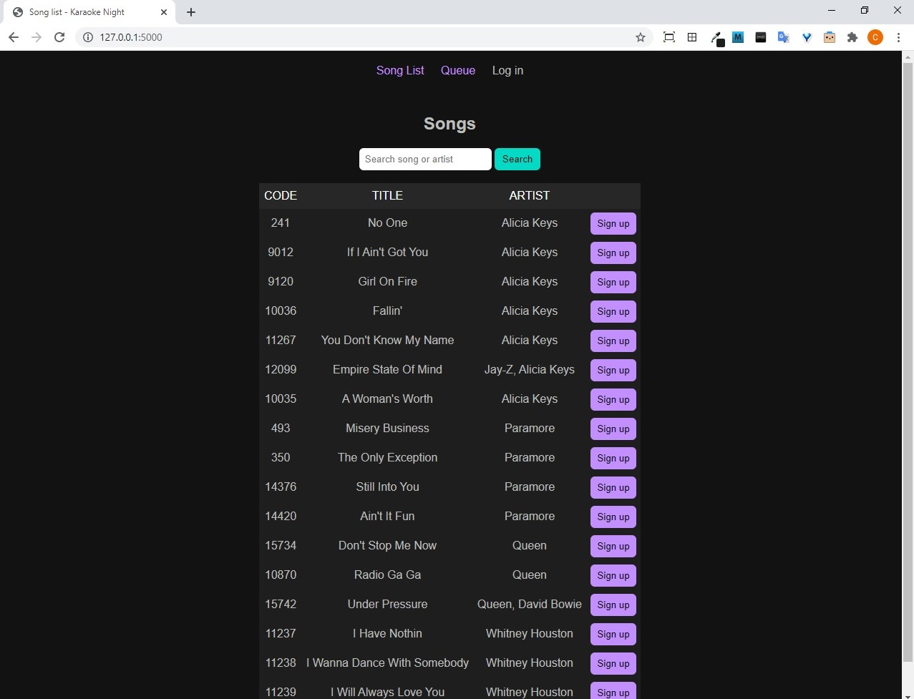
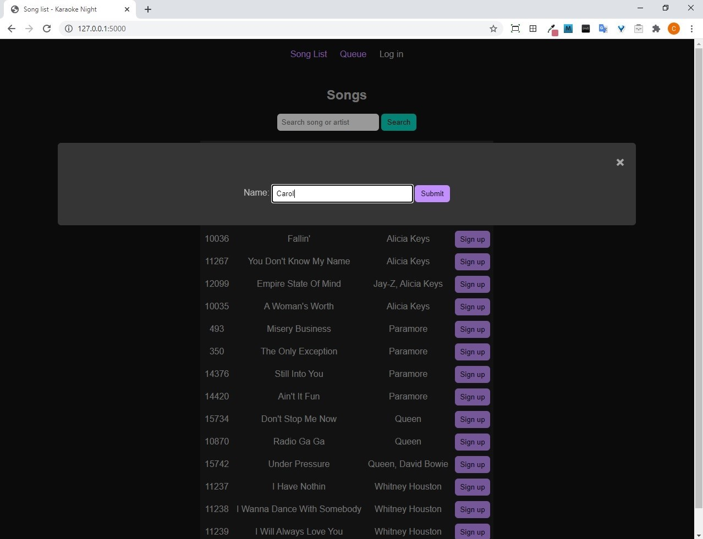
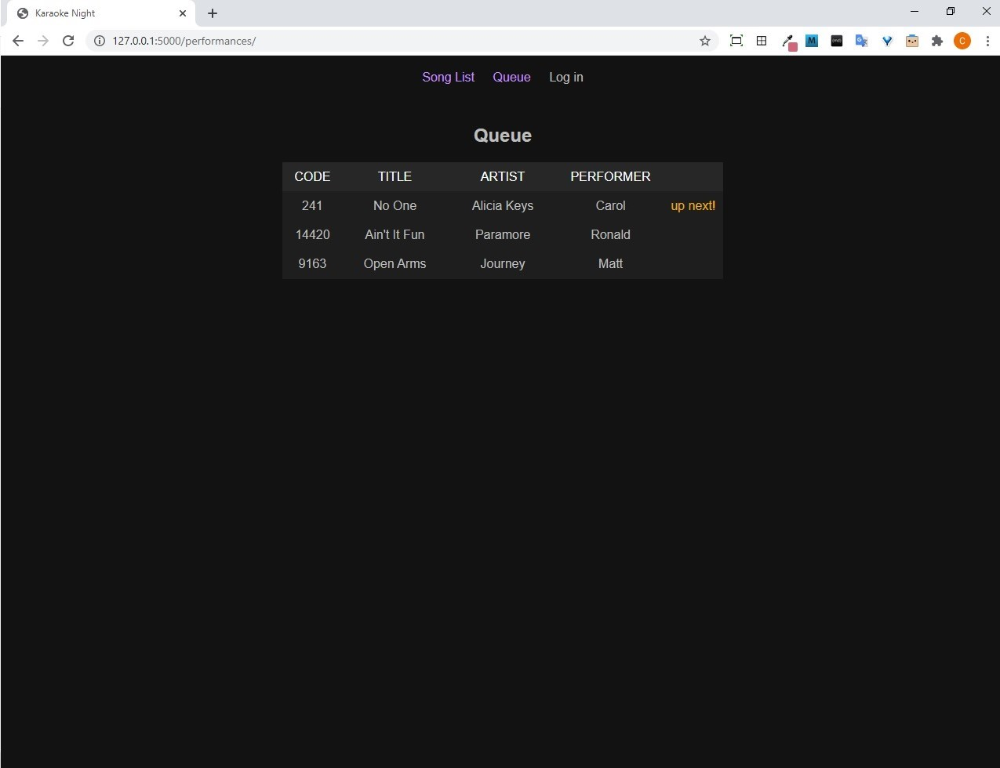

[](https://python.org)
[](https://flask.palletsprojects.com/en/1.1.x/)

# Karaoke Night - Flask web application

## Table of Contents

* [General Info](#general-info)
* [Screenshot](#screenshot)
* [Technologies](#technologies)
* [Setup](#setup)
* [Features](#features)
* [Project Status](#project-status)
* [Inspiration](#inspiration)
* [Contact](#contact)

## General Info
This is a web application to run a karaoke night.

## Screenshot




## Technologies
* Python 3.6.4
* Flask 1.1.2
* Javascript
* HTML
* CSS

## Setup
To run the project on your local machine:

1. Clone the repository:
```
git clone https://github.com/cpadiernos/karaokenight.git
```

2. Create a virtual environment and activate it.

3. Install the requirments:
```
pip install -r karaokenight/requirements.txt
```

4. Go into karaokenight folder:
```
cd karaokenight
```

5. Create the database:
```
flask db upgrade
```

6. Open the flask shell:
```
flask shell
```

7. Create a user that can log in and add songs:
```
from app import db
from app.models import User
user = User(username="admin")
user.set_password("password")
db.session.add(user)
db.session.commit()
```
Now you should be able to log in using username: admin and password: password. Exit out of the shell (aka exit()).

8. Run the development server:
```
set FLASK_ENV=development
flask run
```

You should see something like this:
```
Serving Flask app "karaokenight.py" (lazy loading)
Environment: development
Debug mode: on
Restarting with stat
Debugger is active!
Running on http://127.0.0.1:5000/ (Press CTRL+C to quit)
```

9. Navigate to http://127.0.0.1:5000/ and you'll see the site.


10. At this point the "search" functionality will not be working. In order for it to work, you'll need to download Elasticsearch. 

Instructions to download and run can be found here:
[https://www.elastic.co/guide/en/elasticsearch/reference/current/install-elasticsearch.html](https://www.elastic.co/guide/en/elasticsearch/reference/current/install-elasticsearch.html)

11. Ensure Elasticsearch is up and running by visiting http://localhost:9200


Demo: Coming soon...


## Features
Performer site:
* Searchbar searches by words found in song or artist
* Pop up sign up form for selected song
* Real time queue
* Mobile friendly

Admin site:
* Add, edit, delete songs
* Manage queue
* Temporary snackbar pop up to undo mistaken queue entry deletion
* Responsive site for mobile and desktop

To-dos:
* Create different "rooms"
* Create song cartridge selections (for our karaoke machine, you need to purchase different cartridges which have different sets of songs)

## Project Status
This project is used for fun with friends and family for karaoke night. Could adapt it for commercial use.


## Inspiration
What can I say, I love karaoke.

## Contact
Created by [@cpadiernos](https://www.linkedin.com/in/carolpadiernos/). Feel free to reach out!
